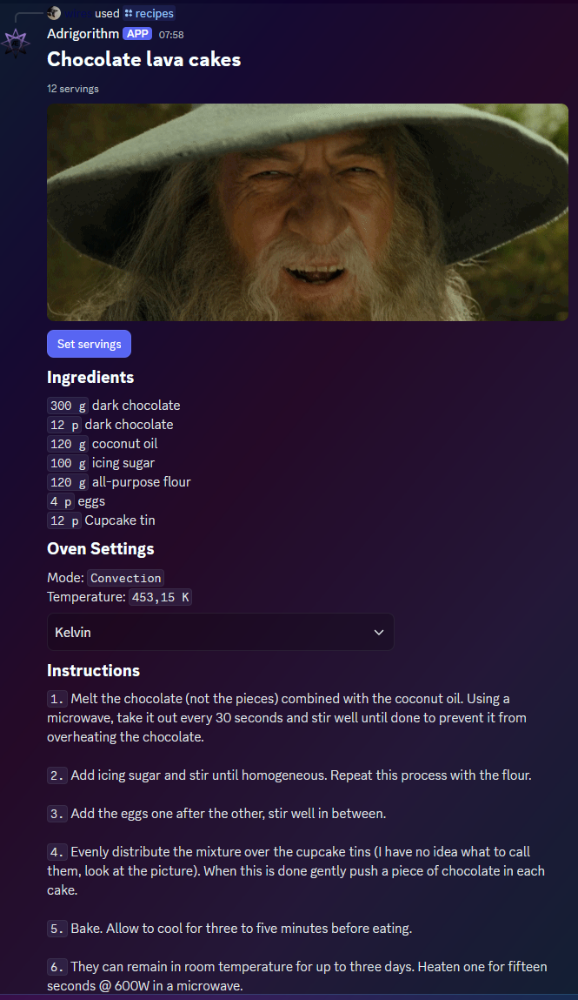
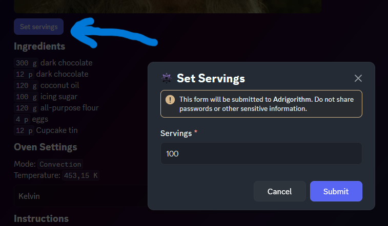
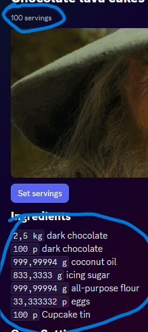
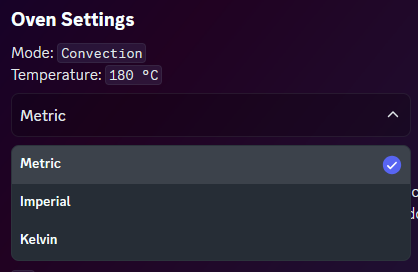

# Component types

As denoted in [Intro], This framework supports a lot of component types.

A full list of components available:

| Type | Name                | Description                                                       | Components V2 only (flag)
|------|---------------------|-------------------------------------------------------------------|---------------------------|
| 1    | Action Row          | Container to display a row of interactive components              | No                        |
| 2    | Button              | Button object                                                     | No                        |
| 3    | String Select       | Select menu for picking from defined text options                 | No                        |
| 4    | Text Input          | Text input object                                                 | No                        |
| 5    | User Select         | Select menu for users                                             | No                        |
| 6    | Role Select         | Select menu for roles                                             | No                        |
| 7    | Mentionable Select  | Select menu for mentionables (users and roles)                    | No                        |
| 8    | Channel Select      | Select menu for channels                                          | No                        |
| 9    | Section             | Container to display text alongside an accessory component        | Yes                       |
| 10   | Text Display        | Markdown text                                                     | Yes                       |
| 11   | Thumbnail           | Small image that can be used as an accessory                      | Yes                       |
| 12   | Media Gallery       | Display images and other media                                    | Yes                       |
| 13   | File                | Displays an attached file                                         | Yes                       |
| 14   | Separator           | Component to add vertical padding between other components        | Yes                       |
| 17   | Container           | Container that visually groups a set of components                | Yes

All components have an id field (generated by default) and must be unique within the message. Generation of ids won't use another id that exists in the message if you have one defined for another component. Sending components with an id of `0` is allowed but will be treated as empty and replaced by the API. You may want to manually assign one if you want to later identify a component this way. Some (interactive) components can be identified using a `customId` instead, which is a unique string (max 100 chars).

**[Action Row](https://discord.com/developers/docs/components/reference#action-row)**

The `ActionRow` component is a parent that contains either
- 1 to 5 `Buttons`
- 1 `TextInput`
- 1 of (`StringSelect`, `UserSelect`, `RoleSelect`, `MentionableSelect`, `ChannelSelect`)

**[Button](https://discord.com/developers/docs/components/reference#button)**

- Must be inside an `ActionRow` or in the accessory field of a `Section`
- Non-link and non-premium buttons must have a custom_id, and cannot have a url or a sku_id.
- Link buttons must have a url, and cannot have a custom_id
- Link buttons do not send an interaction to your app when clicked
- Premium buttons must contain a sku_id, and cannot have a custom_id, label, url, or emoji.
- Premium buttons do not send an interaction to your app when clicked

**[String Select](https://discord.com/developers/docs/components/reference#string-select)** (also other Select variants)
- Must be inside an `ActionRow`
- 1 to 25 `options`
- Placeholder (if specified, up to 150 chars)

It supports multi-select. If you want to use this functionality, you must set `min_values` (0 - 25) and `max_values` (1 - 25).

For all select options:
- Label, value and optionally the description may not exceed `100` chars

**[Text Input](https://discord.com/developers/docs/components/reference#text-input)**
- Must be inside an `ActionRow` in a `Modal`
- Label has a max length of `45`

By default it will accept up to `4000` characters (this is also the maximum). You can change this using the `min_values` and `max_values`

**[Section](https://discord.com/developers/docs/components/reference#section)**

A parent component, this allows you to put `TextDisplays` (1 - 3) next to eachother. It includes an accessory field, which can be used to display a `Thumbnail` or `Button`.

**[Text Display](https://discord.com/developers/docs/components/reference#text-display)**

Just text lol. (With markdown support, just like a regular user; up to 4000 characters)

**[Thumbnail](https://discord.com/developers/docs/components/reference#thumbnail)**

A small image (to use in a `Section`).
- Optionally has a description of max `1024` chars

**[Media Gallery](https://discord.com/developers/docs/components/reference#media-gallery)**

A component used to display up to `10` images.
- Each image can have a description of max `1024` chars

**[File](https://discord.com/developers/docs/components/reference#file)**

Used to send a single file. Only supports the `attachment://` protocol.

**[Separator](https://discord.com/developers/docs/components/reference#separator)**

Just something to put space between components (Y axis).
- Spacing can be set to either `1` (small space) or `2` (large space)
- Visibility can be toggled too. (`IsDivider`)

**[Container](https://discord.com/developers/docs/components/reference#container)**

A parent component with a side bar of customisable colour (like embeds).

In Discord.NET, you typically use these components in conjunction with a `ComponentBuilderV2`. The V2 specific components can be added to the builder using the `WithX` fluent/chain methods whereas the other supported components are mostly children of `ActionRows` and can be added as a component array like used below. You need to know what components can be added to which component though to prevent errors (this is why the above sections exist). If your component structure is wrong, Discord.NET will throw an exception.

This example offers some more insight on how to use them. Below is a component with `TextDisplay`, `MediaGallery` and `ActionRow` (with `Buttons` or `SelectMenu`).

## Code

Some code will not be included here as it is not relevant to this framework. If you want to see the full code, it is [here](https://github.com/Adrigorithm/Adribot/).

The main component container generation method:
[!code-csharp[ComponentBuilderV2 Sample](samples/component.cs)]

## Interactions

The button triggers the following modal

[!code-csharp[Modal Sample](samples/recipe-servings-modal.cs)]

Interactions used by this message:

[!code-csharp[Interaction Sample](samples/recipe-interactions.cs)]

After the **SET SERVINGS** modal is submitted (or the COMBOXBOX is changed) the UI is updated:

## Troubleshooting

### Common issues
- Your interaction may not work if you use components v2 using `ModifyAsync`/`UpdateAsync`/..., if that is the case you must set the MessageFlags.ComponentsV2 flag on the message as mentioned in [CV2_Flag].
- Currently there may be some rare instances where the flag may not be set even when it should, as per [CV2_Flag]. An example is when more than 5 action rows are used. This might get fixed later though. You should set it manually in this case (You can identify this using method described below).

If you run into any trouble (appliction not responding when sending components), a debugger is (like usually) a useful tool to have at your disposal. More specifically within this context: dnet will do some checks before sending the component configuration to discord, so on building the component array, you can check for errors thrown. If this does not help, setting a breakpoint on the line that sends your component to discord (ModifyAsync/RespondAsync/...) and stepping to the next line (within 3 seconds of triggering it) may yield a more specific error returned by Discord itself.

[Intro]: xref:Guides.ComponentsV2.Intro
[CV2_Flag]: xref:Guides.Breakings.V3_18
