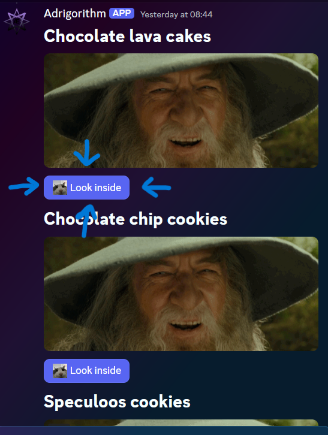

# Interaction with components

## Lifecycle
A component should receive an initial response within a 3 second timeframe. After this it can continue receiving responses for up to 15 minutes, this is useful when a component needs to be rebuilt periodically (buttons etc), which is also what we will be leveraging here.

## Catching of and responding to a user interaction

Before we respond to an interaction triggered by the user we must first "catch" it. You can do this by hooking into the `DiscordSocketClient#InteractionCreated` event. Before proceeding we should make sure that the event was triggered by our component.

The way you get you get/retrieve a specific component from a message is by either their `customId` (this is what is used here) or by using `IEnumerable<IMessageComponent>#FindComponentById`. The latter finds a component by the integer id, and optionally by the type provided as the generic type parameter. Each component is automatically assigned with an incremental id (unique within a given message), unless overriden by the developer. You can see how that works in [Advanced].

Consider this component (the same as used in [Intro]). The buttons have a customId of "recipes-show-me-button-{recipe.RecipeId}", where the last part is an unique identifier.

[!code-csharp[Interactions Sample](samples/interactions.cs)]

UpdateAsync replaces our component array with a new one built based on the button clicked (recipe with the specified ID). More on this more advanced component v2 in [Advanced].

[Intro]: xref:Guides.ComponentsV2.Intro
[Advanced]: xref:Guides.ComponentsV2.Advanced
