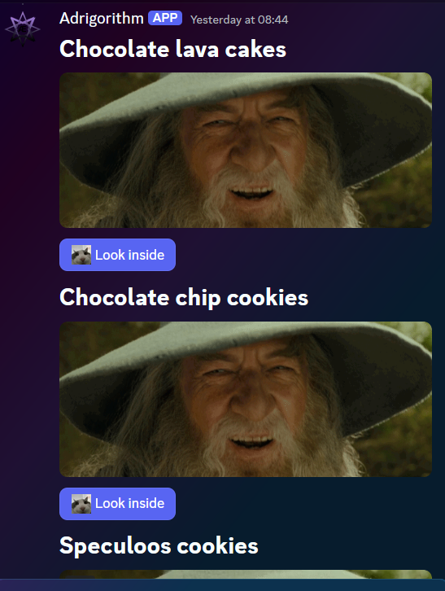

# Message Components V2

Message components V2 is, not unlike Message components (V1) a framework for adding interactive elements to a message your app or bot sends. They're accessible, customizable, and easy to use. Unlike its predecessor, V2 allows for much more control on how and where to display images, ~~buttons~~ bottoms, comboxes and more within a message :3.

## What is a Component

Components are a parameter you can use when sending messages with your bot (just like normal components). With V2 you have a lot more components to choose from though :3. A full list of compatible components can be found [here](https://discord.com/developers/docs/components/reference#component-object-component-types).

## Creating components

Let's create a simple component (array) to start with. First thing we need is a way to trigger the message, this can be done via commands or simply a ready event. Lets make a command that triggers our message.

[!code-csharp[Command Sample](samples/recipes-command.cs)]

The code below returns the value for `recipeService.GetRecipesComponentAsync()`.

[!code-csharp[ComponentBuilderV2 Sample](samples/recipes-component.cs)]

This ComponentBuilderV2 is used to create a message with a text field, an image and a button. Take note on the `customId` property of the `Button`: `$"{RecipesLookInsideButton}-{recipe.RecipeId}"`, it is always important to ensure it is unique within a message, so we can respond to the user interacting with it. More on that later.

